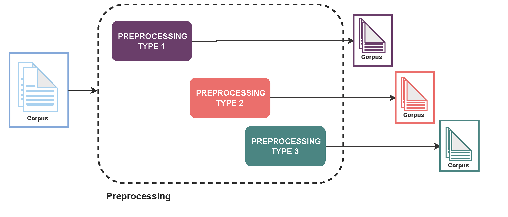
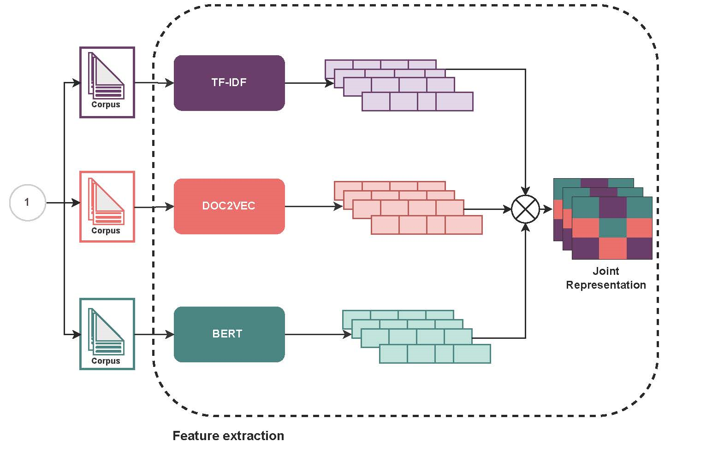

# Eclectic representation of text
<a name="readme-top"></a>

<!-- TABLE OF CONTENTS -->
<details>
  <summary>Table of Contents</summary>
  <ol>
    <li>
      <a href="#about-the-project">About The Project</a>
    </li>
    <li>
    <a href="#implementation">Implementation</a>
    </li> 
    <li>
      <a href="#prerequisites">Prerequisites</a>
    </li>
    <li>
    <a href="#dependencies">Dependencies</a>
    </li> 
    <li>
    <a href="#authors">Authors</a>
    </li> 
  </ol>

</details>

<!-- ABOUT THE PROJECT -->
## About The Project

<p style="text-align: justify;">The project is about how computing and linguistics are converging to equip computers with the ability to process and interpret complex sentence structures of human language, resulting in the emergence of areas like Text Mining and Natural Language Processing. Feature extraction is used to analyze language from a mathematical perspective to extract different text properties as a vector representation. Several feature extraction techniques are commonly used, depending on the purpose of the recognition task, and this project proposes a novel method called an eclectic representation that unifies different informative aspects to improve the effectiveness of recognition models.</p>

<p align="right">(<a href="#readme-top">back to top</a>)</p>

## Implementation
To process a text and obtain its vectors we need to preprocess it. To do this we implemented a set of techniques for text preprocessing based on [NLTK](https://www.nltk.org/) and [Spacy](https://spacy.io/). The workflow in the project is illustrated in Figure 1.
This stage may include:
* Cleaning: undesirable symbols, exclamation points, question marks, hashtags, apostrophes, URLs, HTML tags, in some cases numbers.
* Tokenization: tokenize the documents involves breaking down the phrases into words or n-grams, each of these parts is known as a token.
* Stop words: some words that we usually use in almost all conversations do not carry much value for the purpose of a machine learning task, therefore the most convenient task is to remove them from the text corpus.
* Stemming: is a natural language processing technique that reduces a word to its base or root form, called the "stem". This is done by removing common suffixes or prefixes from a word.
* Lemmatization: is a natural language processing technique that involves reducing a word to its base or dictionary form, called the "lemma". Unlike stemming, lemmatization takes into account the context and the part of speech of the word to ensure that the resulting lemma is a valid word that represents the correct meaning of the original word.

<div align="center">
  
  <p> Figure 1. Text preprocessing. The corpus needs different preprocessing depending on the feature extraction technique used. </p>
</div>


In order to obtain the text vectors of the corpus preprocessed we implemented the next feature extraction techniques:
* TF-IDF
* DOC2VEC
* BERT

Each of the aforementioned approaches provides a representation of the text with a particular value or information richness. This project proposes the possibility of taking advantage of such benefits through a consolidation strategy using a self-organizing map, which is illustrated in Figure 2. The idea of an eclectic representation is to get the best of various feature extraction techniques. We estimate that if instead of using a particular technique we use the three different approaches mentioned above, the result will be a richer text encoding by taking advantage of the benefits of each of the techniques that compose it.

<div align="center">
  
  <p> Figure 2. Feature extraction. Unstructured text data needs to be transformed into a numerical structure to be analyzed and processed. </p>
</div>


<p align="right">(<a href="#readme-top">back to top</a>)</p>

## Prerequisites
Python 3.X installed
```
python --version

Python 3.10.0

```

<p align="right">(<a href="#readme-top">back to top</a>)</p>

## Dependencies
```
pandas==1.3.5
nltk==3.8.1
spacy==3.5.0
spacy-legacy==3.0.12
spacy-loggers==1.0.4
spacy-spanish-lemmatizer==0.7
PyStemmer==2.2.0.1
gensim==4.3.0
numpy==1.23.0
scikit_learn==1.2.1
torch==1.12.1
transformers==4.8.1
pickleshare==0.7.5
```

<p align="right">(<a href="#readme-top">back to top</a>)</p>

## Authors
**Karina Yaneth Gazca Hernández**

**Edwyn Javier Aldana Bobadilla**

<p align="right">(<a href="#readme-top">back to top</a>)</p>
